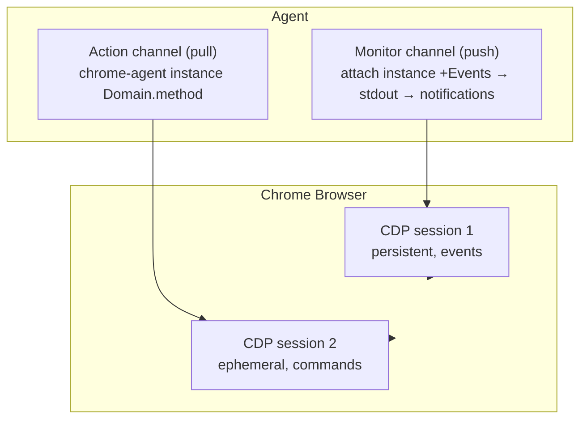

# Monitor Integration

How to use Claude Code's Monitor tool with chrome-agent for real-time browser observation.

## How Monitor Works

Claude Code's Monitor tool runs a background command and streams each stdout line as a real-time notification to the agent. The agent keeps working while notifications arrive asynchronously -- no polling, no blocking.

Key behaviors:

- **Each stdout line is one notification.** Lines within 200ms of each other batch into a single notification.
- **`flush=True` is mandatory for custom scripts.** Python buffers stdout by default. Without `flush=True` on every print, events are delayed by seconds or minutes. The `attach` command handles flushing internally.
- **Too many events auto-stops the monitor.** If the command produces output too fast, the Monitor tool kills it to prevent context overflow. Subscribe to fewer events to stay under the threshold.
- **Monitor is read-only.** The agent receives notifications but cannot write to the monitored command's stdin. This is the fundamental constraint that shapes the architecture.
- **Persistent mode** runs for the session's lifetime. **Timeout mode** auto-stops after a deadline.

## Architecture: Dual Channel

Because Monitor is read-only, the agent uses two channels:



**Monitor channel (push):** `chrome-agent attach <instance> +Event1 +Event2` creates a persistent CDP session, subscribes to the specified events, and streams them to stdout as JSON lines. The agent receives these as real-time notifications. The command runs for the entire session.

**Action channel (pull):** Separate one-shot `chrome-agent <instance> Domain.method` calls for commands and queries -- navigate, take screenshots, read the DOM, dispatch input events. Each creates its own isolated CDP session, does its work, and disconnects. ~50-80ms per call.

Both channels connect to the same browser simultaneously. Chrome multiplexes CDP connections -- they don't interfere. Each attach session's event subscriptions are isolated: subscribing to Network events in one session does not flood another session with Network events.

### Why attach instead of session mode?

`chrome-agent attach` is purpose-built for Monitor. It subscribes to events on startup, streams them to stdout as JSON lines, and requires no stdin interaction for its primary use case (event observation). The agent sends commands in parallel via one-shot calls on the action channel.

`chrome-agent session` reads commands from stdin and writes events to stdout. Monitor can't write to stdin, so session mode through Monitor would give event observation but no way to send commands. The dual-channel architecture avoids this limitation entirely: `attach` for observation, one-shot for action.

## The Attach Command

The `attach` command connects to a named browser instance, creates an isolated CDP session, subscribes to the specified events, and streams them to stdout as JSON lines.

```bash
chrome-agent attach <instance> +Event1 +Event2 [+Event3 ...]
```

**Startup order matters:** The browser must be running before attach connects. Launch with `chrome-agent launch` first, then start the attach session.

### Event Subscription Sets

There are no built-in tiers or presets. You subscribe to exactly the events you need. Here are common subscription sets:

**Navigation only (2-3 events per page load)**

```bash
chrome-agent attach myapp +Page.frameNavigated +Page.loadEventFired
```

Use when: following along with a browsing session, minimal noise.

**Navigation + errors**

```bash
chrome-agent attach myapp +Page.frameNavigated +Page.loadEventFired \
  +Runtime.exceptionThrown +Network.loadingFailed
```

Use when: monitoring for problems while the browser is in use.

**Navigation + network**

```bash
chrome-agent attach myapp +Page.frameNavigated +Page.loadEventFired \
  +Network.requestWillBeSent
```

Use when: watching API calls, tracking what requests the page makes.

**Navigation + errors + network**

```bash
chrome-agent attach myapp +Page.frameNavigated +Page.loadEventFired \
  +Runtime.exceptionThrown +Network.loadingFailed \
  +Network.requestWillBeSent
```

Use when: debugging a web app during development.

**Console output**

```bash
chrome-agent attach myapp +Runtime.consoleAPICalled +Runtime.exceptionThrown
```

Use when: watching for console logs and exceptions.

### Output Format

Each event is a single JSON line:

```json
{"method": "Page.frameNavigated", "params": {"frame": {"id": "...", "url": "https://example.com", ...}}}
{"method": "Page.loadEventFired", "params": {"timestamp": 12345.678}}
{"method": "Runtime.exceptionThrown", "params": {"exceptionDetails": {...}}}
```

On startup, attach emits a ready line:

```json
{"status": "ready", "sessionId": "ABC123...", "target": "DEF456..."}
```

### Filtering Downstream

Attach passes events through without filtering. If you need to reduce noise, filter downstream with standard tools:

```bash
# Only show navigation events
chrome-agent attach myapp +Page.frameNavigated +Page.loadEventFired \
  +Network.requestWillBeSent | jq 'select(.method | startswith("Page."))'

# Save all events to a file while also watching for errors
chrome-agent attach myapp +Page.frameNavigated +Page.loadEventFired \
  +Runtime.exceptionThrown +Network.requestWillBeSent \
  > /tmp/events.jsonl &
```

### Dynamic Subscriptions

Attach also accepts subscription changes on stdin while running:

```
+Network.responseReceived    # subscribe to a new event
-Network.requestWillBeSent   # unsubscribe from an event
```

This is useful when running attach interactively but is not relevant when running via Monitor (which cannot write to stdin).

## Usage Patterns

### Pattern 1: Agent browses with real-time awareness

The agent drives the browser and the monitor provides feedback. The agent doesn't need to explicitly check after each action -- the monitor confirms what happened.

```
Agent starts monitor (see "Starting the Monitor" below)

Agent runs:      chrome-agent myapp Page.navigate '{"url": "https://example.com/login"}'

Monitor reports: {"method": "Page.frameNavigated", "params": {"frame": {"url": "https://example.com/login", ...}}}
                 {"method": "Page.loadEventFired", "params": {...}}

Agent runs:      chrome-agent myapp Runtime.evaluate '{"expression": "..."}'  (fill form)
Agent runs:      chrome-agent myapp Input.dispatchMouseEvent ...              (click submit)

Monitor reports: {"method": "Network.requestWillBeSent", "params": {"request": {"url": "https://api.example.com/auth", ...}}}
                 {"method": "Page.frameNavigated", "params": {"frame": {"url": "https://example.com/dashboard", ...}}}
                 {"method": "Page.loadEventFired", "params": {...}}

Agent knows:     Login succeeded (saw navigation to dashboard, no errors).
```

Without the monitor, the agent would need to explicitly check the URL and page state after each action. With the monitor, confirmation arrives automatically.

### Pattern 2: Agent observes a human

The human browses. The agent watches via Monitor and answers questions or catches problems.

```
Agent starts monitor with navigation + error events

Human clicks:    (navigates to various pages)
Monitor reports: {"method": "Page.frameNavigated", "params": {"frame": {"url": "https://myapp.com/products", ...}}}
                 {"method": "Page.loadEventFired", "params": {...}}
                 {"method": "Page.frameNavigated", "params": {"frame": {"url": "https://myapp.com/products/42", ...}}}
                 {"method": "Network.loadingFailed", "params": {"errorText": "net::ERR_FILE_NOT_FOUND", ...}}

Agent responds:  "I see a loading failure on the product detail page.
                  Let me check which resource failed."
Agent runs:      chrome-agent myapp Runtime.evaluate '{"expression": "..."}'
Agent runs:      chrome-agent myapp Page.captureScreenshot '{"format": "png"}'
```

The monitor is the agent's peripheral vision -- it notices the error without being asked to look.

### Pattern 3: Agent observes another agent

Agent A drives the browser. Agent B monitors. This is the multi-agent testing pattern.

```
Agent B starts:  monitor with navigation + errors + network events

Agent A runs:    chrome-agent myapp Page.navigate '{"url": "http://localhost:3000/checkout"}'

Agent B sees:    {"method": "Page.frameNavigated", "params": {"frame": {"url": "http://localhost:3000/checkout", ...}}}
                 {"method": "Page.loadEventFired", "params": {...}}

Agent A runs:    (fills form fields via Runtime.evaluate + Input events)

Agent B sees:    {"method": "Network.requestWillBeSent", "params": {"request": {"url": "http://localhost:3000/api/validate-email", ...}}}

Agent A runs:    (clicks submit)

Agent B sees:    {"method": "Network.requestWillBeSent", "params": {"request": {"url": "http://localhost:3000/api/orders", "method": "POST", ...}}}
                 {"method": "Page.frameNavigated", "params": {"frame": {"url": "http://localhost:3000/order/12345", ...}}}
                 {"method": "Page.loadEventFired", "params": {...}}

Agent B knows:   Agent A completed the checkout flow. The order API was called.
                 The confirmation page loaded. No errors.
```

Agent B sees Agent A's actions through their consequences (navigation events, network requests). Each agent's attach session is isolated -- Agent B's event subscriptions don't affect Agent A's CDP connection.

### Pattern 4: Error-triggered investigation

The agent works on code while the monitor watches the browser. When an error appears, the agent investigates.

```
Agent:           (editing source code)
Monitor reports: {"method": "Runtime.exceptionThrown", "params": {"exceptionDetails": {"text": "TypeError: Cannot read properties of null", ...}}}

Agent responds:  "I see an unhandled TypeError. Let me check."
Agent runs:      chrome-agent myapp Runtime.evaluate '{"expression": "..."}'
Agent runs:      chrome-agent myapp Page.captureScreenshot '{"format": "png"}'
Agent:           (reads the code, identifies the fix, edits the file)

Monitor reports: {"method": "Page.frameNavigated", "params": {...}}  (hot reload)
                 {"method": "Page.loadEventFired", "params": {...}}
                 (no more errors)

Agent:           "The error is fixed. The page reloaded cleanly."
```

### Pattern 5: Background event logging

Redirect attach output to a file for later analysis. The agent can review the log at any time without a live monitor.

```bash
chrome-agent attach myapp +Page.frameNavigated +Page.loadEventFired \
  +Network.requestWillBeSent +Runtime.exceptionThrown \
  > /tmp/events.jsonl &
```

The agent (or a human) can then search or analyze the log:

```bash
# Find all errors
jq 'select(.method == "Runtime.exceptionThrown")' /tmp/events.jsonl

# Count requests by domain
jq -r 'select(.method == "Network.requestWillBeSent") | .params.request.url' /tmp/events.jsonl | sort | uniq -c | sort -rn
```

## Push vs Pull

The monitor provides push (events arrive when they happen). One-shot commands provide pull (the agent asks for information when it wants it).

| Need | Channel | Why |
|------|---------|-----|
| Did the page navigate? | Push (monitor) | You don't know when it will happen |
| What URL am I on? | Pull (one-shot) | Instant answer |
| Did an error occur? | Push (monitor) | Errors are unpredictable |
| What does the page look like? | Pull (screenshot) | Snapshots are point-in-time |
| What text is on the page? | Pull (Runtime.evaluate) | DOM state is a snapshot |
| Is the page loaded? | Push (monitor) | Timing matters |
| Did the API call succeed? | Push (Network events) | You need to know when |

**Heuristic:** If you need to know **when** something happens, use push. If you need to know **what** something is, use pull.

## Starting the Monitor

The agent invokes the Monitor tool in the conversation. The tool takes a shell command, a description, and a persistence setting. Here is what the tool invocation looks like:

For session-length observation:

```
Monitor tool:
  command:     "chrome-agent attach myapp +Page.frameNavigated +Page.loadEventFired +Runtime.exceptionThrown +Network.loadingFailed"
  description: "Browser observer (navigation + errors)"
  persistent:  true
```

For time-bounded observation (e.g., watching a specific test run):

```
Monitor tool:
  command:     "chrome-agent attach myapp +Page.frameNavigated +Page.loadEventFired +Runtime.exceptionThrown"
  description: "Watching test run"
  timeout_ms:  300000  (5 minutes)
  persistent:  false
```

The agent receives each stdout line from the attach command as a real-time notification in the conversation. To stop the monitor, use the TaskStop tool with the monitor's task ID.

## Handoff

The agent can switch from observing to acting without stopping the monitor. It simply starts sending commands via one-shot calls. The monitor continues running on its own isolated CDP session, reporting the consequences of the agent's actions alongside any human activity.

To fully stop observing: use TaskStop with the monitor's task ID. Then the agent operates through one-shot commands only.

## Troubleshooting

**Monitor auto-stops:** The page is generating too many events. Subscribe to fewer events -- remove `Network.requestWillBeSent` first (high-traffic pages can produce hundreds of network events per load). If you need network visibility on noisy pages, filter downstream with `jq` and pipe only matched lines to a secondary script that prints to stdout.

**No events appearing:** Check that the browser is running (`chrome-agent status`). The attach command prints a `{"status": "ready", ...}` line on startup -- if you don't see this, it failed to connect. Most common cause: the browser wasn't launched yet. Launch first, then start the attach session.

**Events appear delayed:** This should not happen with the `attach` command, which flushes every line. If you are writing a custom observation script, ensure all `print()` calls use `flush=True`.

**Attach exits immediately:** The instance name may not be registered. Run `chrome-agent status` to see registered instances and their names. If the instance was launched before the registry existed, relaunch it.

**Multiple page targets:** If the browser has multiple tabs, attach auto-selects when there is exactly one page target. With multiple targets, it reports the available targets and exits. Use `--target` (ID prefix or 1-based index) or `--url` (substring match) to specify which tab:

```bash
chrome-agent attach myapp +Page.loadEventFired --url localhost:3000
chrome-agent attach myapp +Page.loadEventFired --target 1
```

**Browser crashes while attached:** The attach process exits with `{"error": "Browser disconnected"}` on stdout and terminates. Monitor sees this as the process ending. Recovery: check `chrome-agent status` to confirm the instance is dead, relaunch with `chrome-agent launch`, and restart the attach session against the new instance. Events between the crash and the new attach are lost -- there is no replay.

**Attach process killed by Monitor or OOM:** The CDP session is destroyed and subscriptions die with it. The browser continues running normally. Other participants are unaffected. Recovery: restart the attach session with the same command. Subscriptions start fresh.
