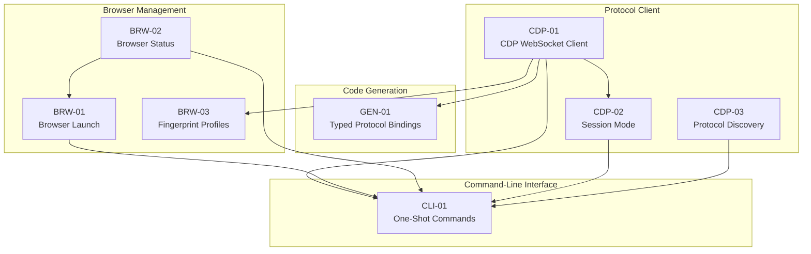

# Dependency Matrix

> *This document is the validated global dependency structure for this iteration's features -- synthesized from the individual dependencies identified in each Feature Specification's Dependencies section.*

## 1. Feature Dependency Matrix

| Feature | Name | Depends On | What It Needs | Rationale |
|---------|------|-----------|---------------|-----------|
| **CDP** | | | | |
| CDP-01 | CDP WebSocket Client | None | -- | -- |
| CDP-02 | Session Mode | CDP-01 | CDPClient class for WebSocket connection -- send(), on(), off(), connect(), close() | Session mode wraps the CDP client with a stdin/stdout bridge |
| CDP-03 | Protocol Discovery | None | -- | -- |
| **GEN** | | | | |
| GEN-01 | Typed Protocol Bindings | CDP-01 | CDPClient class that generated code wraps -- generated methods delegate to self._client.send() | Generated domain classes need a client to send commands through |
| **BRW** | | | | |
| BRW-01 | Browser Launch | BRW-02 | check_cdp_port() to poll for port readiness after launch | Need to know when the browser is ready to accept connections |
| BRW-02 | Browser Status | None | -- | -- |
| BRW-03 | Fingerprint Profiles | CDP-01 | CDPClient for connecting to the browser and sending CDP commands | Fingerprint application uses CDP commands (Page.addScriptToEvaluateOnNewDocument, Emulation domain) |
| **CLI** | | | | |
| CLI-01 | One-Shot Commands | CDP-01, BRW-01, BRW-02, CDP-02, CDP-03 | **CDP-01:** CDPClient, get_ws_url for one-shot CDP commands   **BRW-01:** launch_browser, cleanup_sessions for launch and cleanup commands   **BRW-02:** check_cdp_port for the status command   **CDP-02:** run_session for the session command   **CDP-03:** discover_protocol for the help command | CLI routes to each feature's function |

## 2. Dependency Graph

## 3. Validation and Resolution Log

### 3.1 Dependencies Discovered

| Discovered Dependency | How It Was Found | Back-propagated To |
|---|---|---|

### 3.2 Dependencies Removed

| Declared Dependency | Why It Was Declared | Why It's Not a Technical Dependency |
|---|---|---|
| BRW-01 → BRW-03 | Browser Launch optionally applies a fingerprint profile after launch | Optional code path -- Browser Launch works without fingerprinting. The fingerprint is applied by the caller (CLI-01 calls apply_fingerprint separately when --fingerprint is provided), not by launch_browser itself. |

### 3.3 Circular Dependencies Resolved

No circular dependencies were detected.

## 4. Companion Data File Reference

The machine-readable dependency structure is at `planning/04-dependency-graph.json`. Analysis scripts are in `planning/04-analysis/`.
