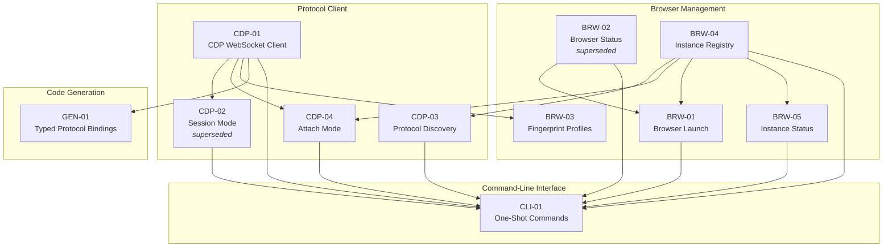

# Dependency Matrix

> *This document is the validated global dependency structure for this iteration's features -- synthesized from the individual dependencies identified in each Feature Specification's Dependencies section.*

## 1. Feature Dependency Matrix

| Feature | Name | Depends On | What It Needs | Rationale |
|---------|------|-----------|---------------|-----------|
| **CDP** | | | | |
| CDP-01 | CDP WebSocket Client | None | -- | Foundation feature, no dependencies |
| CDP-02 | Session Mode *(superseded by CDP-04)* | CDP-01 | CDPClient class for WebSocket connection | Session mode wraps the CDP client with stdin/stdout bridge |
| CDP-03 | Protocol Discovery | BRW-04 | `lookup()` and `enumerate_instances()` for instance name resolution and auto-selection | CLI syntax changes from `--port` to instance names |
| CDP-04 | Attach Mode | CDP-01, BRW-04 | **CDP-01:** CDPClient, get_ws_url(), send(), on(), off() for persistent connection and session management **BRW-04:** lookup(instance_name) to resolve instance name to port | **CDP-01:** The persistent connection and session management are built on CDPClient **BRW-04:** Attach needs the browser's CDP port to connect |
| **GEN** | | | | |
| GEN-01 | Typed Protocol Bindings | CDP-01 | CDPClient class that generated code wraps | Generated methods delegate to self._client.send() |
| **BRW** | | | | |
| BRW-01 | Browser Launch | BRW-02, BRW-04 | **BRW-02:** check_cdp_port() for port readiness polling **BRW-04:** registry.register() and registry.allocate_port() for naming and port allocation | **BRW-02:** Need to know when browser is ready **BRW-04:** Launch delegates port allocation and instance naming to registry |
| BRW-02 | Browser Status *(superseded by BRW-05)* | None | -- | Uses stdlib only, no feature dependencies |
| BRW-03 | Fingerprint Profiles | CDP-01 | CDPClient for CDP commands (Page.addScriptToEvaluateOnNewDocument, Emulation domain) | Fingerprint application uses CDP commands |
| BRW-04 | Instance Registry | None | -- | Foundational infrastructure, stdlib only |
| BRW-05 | Instance Status | BRW-04 | enumerate_instances() and lookup() for instance discovery and filtering | Status reads registry to discover instances |
| **CLI** | | | | |
| CLI-01 | One-Shot Commands | CDP-01, BRW-01, BRW-02, CDP-02, CDP-03, BRW-04, CDP-04, BRW-05 | Routes to all feature modules: CDPClient for one-shot, launch_browser for launch, check_cdp_port for status, run_session/run_attach for session/attach, discover_protocol for help, registry for instance name resolution, get_instance_status for status | CLI is the routing layer that delegates to every other feature |

## 2. Dependency Graph

## 3. Validation and Resolution Log

### Dependencies Discovered

No additional dependencies discovered during cross-cutting analysis. The per-feature specification process captured all dependencies accurately.

### Dependencies Removed

No dependencies removed. All declared dependencies passed the binary dependency test.

### Circular Dependencies Resolved

No circular dependencies detected. Confirmed algorithmically via `planning/04-analysis/cycle_detection.py`.

## 4. Analysis Summary

**Root features (no dependencies):** CDP-01 (CDP WebSocket Client), BRW-02 (Browser Status), BRW-04 (Instance Registry)

**Leaf features (nothing depends on them):** GEN-01 (Typed Protocol Bindings), BRW-03 (Fingerprint Profiles), CLI-01 (One-Shot Commands)

**Key structural observations:**
- **BRW-04 (Instance Registry) is the new hub** for iteration 2 -- four features depend on it (CDP-03, CDP-04, BRW-01, BRW-05), plus CLI-01 indirectly
- **CDP-01 remains the foundation** from iteration 1 -- depended on by CDP-02, CDP-04, GEN-01, BRW-03, and CLI-01
- **CLI-01 is the integration point** -- depends on everything because it routes to all features
- **No cycles** -- the graph is a clean DAG

**Iteration 2 implementation scope:**
- 3 new features: BRW-04, CDP-04, BRW-05
- 3 updates to existing features: BRW-01, CLI-01, CDP-03
- 2 superseded features: CDP-02 (by CDP-04), BRW-02 (by BRW-05)
- Features from iteration 1 that are unchanged: CDP-01, GEN-01, BRW-03
