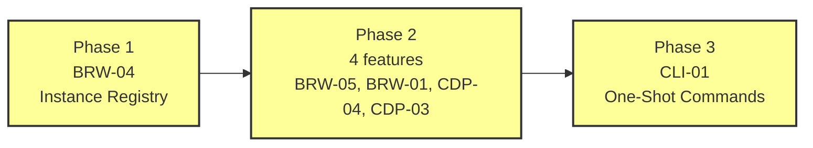

# Implementation Plan

> *This document is the comprehensive, phase-organized execution strategy for the project. It transforms the validated dependency structure from Step 4 into an actionable roadmap.*

## 1. Phase Structure

### Phase Overview

This plan covers **iteration 2 scope only** -- 3 new features and 3 updates to existing features. Iteration 1 features (CDP-01, CDP-02, BRW-02, BRW-03, GEN-01) are already implemented and not re-tracked.

| Phase | Features | Count | Dependencies Satisfied By |
|-------|----------|-------|--------------------------|
| 1 | BRW-04 (Instance Registry) | 1 | None -- root feature |
| 2 | BRW-05 (Instance Status) | 4 | Phase 1: BRW-04 |
| | BRW-01 (Browser Launch update) | | Phase 1: BRW-04 + iter 1: BRW-02 |
| | CDP-04 (Attach Mode) | | Phase 1: BRW-04 + iter 1: CDP-01 |
| | CDP-03 (Protocol Discovery update) | | Phase 1: BRW-04 |
| 3 | CLI-01 (One-Shot Commands update) | 1 | Phase 1: BRW-04 + Phase 2: all + iter 1: CDP-01, BRW-02, CDP-02 |

### Critical Path

The critical path runs through all 3 phases: BRW-04 -> (any Phase 2 feature) -> CLI-01. Every feature is on the critical path since Phase 1 and Phase 3 have single features, and Phase 2 must complete entirely before Phase 3 begins. Phase 2 is the widest phase with 4 features -- the main parallelism opportunity.

## 2. Phase Details

### Phase 1

#### Features

- BRW-04 (Instance Registry) -- **new**

#### Parallel Development Opportunities

Single feature -- no parallelism. This is the foundational feature that everything else depends on.

#### Recommended Implementation Order

1. BRW-04 -- creates `registry.py` with register, lookup, enumerate, cleanup, allocate_port, derive_instance_name. Also extracts `process_is_running` to a shared utility module.

#### Phase Completion Criteria

- BRW-04: All test definitions pass -- register/lookup, sequential registration, port override, port skips occupied, name special characters, lookup not found, lookup empty registry, enumerate mixed liveness, cleanup removes stale, cleanup preserves live, corrupted registry recovery
- `process_is_running` extracted to shared utility, imported by both registry and launcher
- **Phase gate:** BRW-04 complete, all tests passing. Phase 2 features may begin.

### Phase 2

#### Features

- BRW-05 (Instance Status) -- **new**
- BRW-01 (Browser Launch) -- **update**
- CDP-04 (Attach Mode) -- **new**
- CDP-03 (Protocol Discovery) -- **update**

#### Parallel Development Opportunities

All 4 features depend on BRW-04 (Phase 1) but not on each other. They could all be built in parallel. However, sequential ordering provides benefits:

- BRW-05 is the simplest (Small complexity) and validates that the registry interfaces work correctly from a consumer's perspective. Building it first exercises the registry before more complex features depend on it.
- BRW-01 update integrates the registry with the launch flow. After this, `chrome-agent launch` creates named instances -- providing the infrastructure that CDP-04 and CDP-03 need for end-to-end testing.
- CDP-04 is the most complex feature (Large complexity). Building it after BRW-05 and BRW-01 means the registry is well-exercised and launch produces registered instances that attach can connect to.
- CDP-03 update is the simplest change (just instance name routing). It can go last because nothing else in this phase depends on it.

#### Recommended Implementation Order

1. BRW-05 (Instance Status) -- simplest new feature, validates registry consumer interface
2. BRW-01 (Browser Launch update) -- integrates registry with launch, enables end-to-end testing
3. CDP-04 (Attach Mode) -- most complex, benefits from registry being exercised via launch
4. CDP-03 (Protocol Discovery update) -- simplest update, independent of other Phase 2 features

#### Phase Completion Criteria

- BRW-05: Status lists all instances with page targets, dead instances shown, single-instance filtering works
- BRW-01: Launch auto-allocates ports, registers instances, returns InstanceInfo, structured JSON output works
- CDP-04: Attach connects with isolated subscriptions, events stream to stdout, cross-session event delivery works, clean shutdown on EOF/SIGTERM
- CDP-03: Help resolves instance names, auto-selects single live instance, explicit port fallback works
- **Integration verification:** Launch an instance -> status shows it -> attach to it -> verify events flow -> one-shot commands work alongside attach -> help resolves the instance name
- **Phase gate:** All 4 features complete, all tests passing, integration pipeline verified. Phase 3 may begin.

### Phase 3

#### Features

- CLI-01 (One-Shot Commands) -- **update**

#### Parallel Development Opportunities

Single feature -- no parallelism. This is the integration layer that wires everything together.

#### Recommended Implementation Order

1. CLI-01 -- rewrites the routing logic for instance name addressing, adds attach route, updates status routing, adds flag extraction for --target/--url, adds default instance resolution, adds help disambiguation

#### Phase Completion Criteria

- CLI-01: All routing forms work correctly (operational commands, instance+method, bare method with default resolution, attach, status with instance filter, help disambiguation)
- --target and --url flag extraction works, mutual exclusivity enforced
- Backward compatibility: `chrome-agent Page.navigate '...'` still works via default instance resolution
- **Integration verification:** Full end-to-end workflow from terminal: launch -> status -> attach in background -> one-shot navigate -> verify attach captured events -> help with instance name -> cleanup
- **Phase gate:** All tests passing, full end-to-end verified, no regressions in iteration 1 tests.

## 3. Execution Strategy

### Phase Gates

All features in a phase must pass their tests before the next phase begins. No regressions in prior phase tests -- the full test suite must pass at each gate, not just the new tests. Progress tracking is updated after each feature completion.

### Feature Selection Guidance

Follow the recommended implementation order within each phase. The order is advisory, not strict -- if a feature reveals that a different ordering would be more efficient (e.g., learning from BRW-05 suggests modifying the registry before updating BRW-01), reorder as needed. Critical-path features (all of them in this iteration) take priority over perfectionism on non-critical concerns.

### Blocker Management

- **Technical obstacles:** Attempt to resolve from the spec and existing code context. Use exploratory coding to test hypotheses before changing the approach.
- **Spec gaps:** If a spec doesn't address a situation encountered during implementation, resolve it using the spec's design principles and existing patterns in the codebase. Document the resolution in the spec's Implementation Status.
- **Dependency issues:** If a Phase 2 feature discovers a problem with BRW-04's interface, fix BRW-04 first, re-run its tests, then continue.
- **External system behavior:** If Chrome's CDP behavior doesn't match assumptions in the spec, explore empirically (we have a browser running), update the spec, and adapt.
- **Escalation:** Only escalate to user for architectural decisions that fundamentally change the design direction -- not for implementation details the spec leaves to the implementer.

### Risk Identification

| Feature | Risk | Mitigation |
|---------|------|------------|
| CDP-04 (Attach Mode) | Most complex new feature -- browser-level WebSocket, Target.attachToTarget, event isolation, concurrent operation with one-shot, signal handling | Implement after BRW-05 and BRW-01 so registry is well-exercised. Leverage the experiment scripts from earlier in this session (exp1, exp2, exp3 at /tmp/) as reference implementations. |
| CLI-01 (One-Shot Commands) | Three-way routing logic is the highest-risk change. Argument parsing for flags interleaved with positional args. Backward compatibility with bare CDP methods. | Implement last (Phase 3) so all dependencies are stable. Test every command form that the review agents walked through. |
| BRW-01 (Browser Launch update) | Signature change from `port: int` to `port_override: int | None` breaks existing callers. LaunchResult -> InstanceInfo transition. | Update all call sites (CLI, tests) as part of the implementation. Run full test suite after changes. |

## 4. Implementation Progress

### Progress Table

| Phase | Feature | Status | Notes |
|-------|---------|--------|-------|
| 1 | BRW-04 Instance Registry | Not started | |
| 2 | BRW-05 Instance Status | Not started | |
| 2 | BRW-01 Browser Launch (update) | Not started | |
| 2 | CDP-04 Attach Mode | Not started | |
| 2 | CDP-03 Protocol Discovery (update) | Not started | |
| 3 | CLI-01 One-Shot Commands (update) | Not started | |

### Phase Status

| Phase | Gate Satisfied | Notes |
|-------|---------------|-------|
| 1 | No | |
| 2 | No | |
| 3 | No | |

## 5. Companion Data File Reference

The machine-readable companion file is at `planning/05-implementation-plan.json`. It contains the same phase structure, feature ordering, and progress tracking as this document, in JSON format consumed by the Implementation Loop for feature selection and progress updates.
