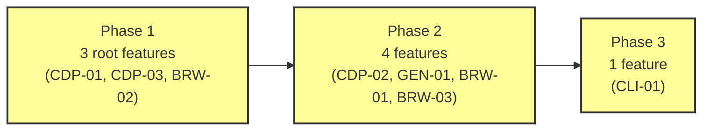

# Implementation Plan

> *This document is the comprehensive, phase-organized execution strategy for the project. It transforms the validated dependency structure from Step 4 into an actionable roadmap.*

## 1. Phase Structure

### Phase Overview

| Phase | Features | Count | Dependencies Satisfied By |
|-------|----------|-------|--------------------------|
| 1 | CDP-01 (CDP WebSocket Client)   CDP-03 (Protocol Discovery)   BRW-02 (Browser Status) | 3 | None -- root features |
| 2 | CDP-02 (Session Mode)   GEN-01 (Typed Protocol Bindings)   BRW-01 (Browser Launch)   BRW-03 (Fingerprint Profiles) | 4 | Phase 1: CDP-01, BRW-02 |
| 3 | CLI-01 (One-Shot Commands) | 1 | Phase 1: CDP-01, CDP-03, BRW-02   Phase 2: CDP-02, BRW-01 |

### Critical Path

The critical path runs: **CDP WebSocket Client → Session Mode → One-Shot Commands**. This is the longest sequential chain -- 3 phases, can't be compressed. CDP WebSocket Client is the most critical feature: it blocks 4 of the 7 downstream features. Any delay in CDP WebSocket Client cascades through the entire plan.

Phase 1 has 3 independent features and Phase 2 has 4 independent features -- significant parallel opportunity in both. Phase 3 is a single feature that integrates everything.

Protocol Discovery and Browser Status are off the critical path -- delays in either can be absorbed within Phase 1 without pushing back Phase 2 (as long as Browser Status finishes before Browser Launch needs it in Phase 2).

## 2. Phase Details

### Phase 1

#### Features

- CDP-01 (CDP WebSocket Client)
- CDP-03 (Protocol Discovery)
- BRW-02 (Browser Status)

#### Parallel Development Opportunities

All three features are fully independent -- no formal or conceptual dependencies between them. However, CDP WebSocket Client establishes the async patterns and connection infrastructure that Phase 2 features will build on. Building it first gives a working foundation to test against.

Browser Status and Protocol Discovery are both small, stdlib-only features with no async complexity. They can be built in parallel with each other at any point during Phase 1.

#### Recommended Implementation Order

1. **CDP WebSocket Client** -- on the critical path, foundation for everything. Establishes the async patterns (context manager, event dispatch, error propagation) that the rest of the project follows. Build first.
2. **Browser Status** -- small, already exists in the current codebase. Quick to port. Browser Launch in Phase 2 needs it.
3. **Protocol Discovery** -- small, standalone. Lowest priority in Phase 1 because only One-Shot Commands (Phase 3) depends on it.

#### Phase Completion Criteria

- **CDP WebSocket Client**: All tests pass -- command round-trip, event subscription and delivery, message ID correlation, session multiplexing (sessionId routing), CDP error propagation, WebSocket disconnection handling, context manager lifecycle (normal and exception paths). The client connects to a real browser, sends commands, and receives events.
- **Browser Status**: All tests pass -- detects running browser with version/URL/title, reports "no browser" on empty port, handles non-Chrome port gracefully.
- **Protocol Discovery**: All tests pass -- lists domains, shows domain detail, shows method detail, handles no-browser and unknown-domain errors. `fetch_protocol_schema()` returns valid schema JSON from a running browser.
- **Integration verification**: CDP WebSocket Client connects to a browser that Browser Status confirms is running. Protocol Discovery queries the same browser's protocol schema endpoint.
- **Phase gate**: All 3 features complete, all tests passing, integration verified. Phase 2 may begin.

### Phase 2

#### Features

- CDP-02 (Session Mode)
- GEN-01 (Typed Protocol Bindings)
- BRW-01 (Browser Launch)
- BRW-03 (Fingerprint Profiles)

#### Parallel Development Opportunities

All four features are independent of each other -- they share Phase 1 dependencies (CDP WebSocket Client, Browser Status) but not each other. All four could theoretically be built in parallel.

Session Mode and Typed Protocol Bindings both build on CDP WebSocket Client but in completely different ways -- Session Mode wraps it in a stdin/stdout bridge, Typed Protocol Bindings generates code that delegates to it. No conceptual overlap.

Browser Launch and Fingerprint Profiles operate in the same domain (browser management) but are independent -- Launch starts a browser, Fingerprint Profiles configures one that's already running.

#### Recommended Implementation Order

1. **Session Mode** -- on the critical path. Blocking Phase 3. Most complex feature in the iteration. Build first to surface problems early.
2. **Browser Launch** -- highest risk (platform-specific binary discovery, subprocess lifecycle). Build early to catch environment-specific failures.
3. **Typed Protocol Bindings** -- the code generator. Can run in parallel with Browser Launch since they're independent. Produces the library API surface.
4. **Fingerprint Profiles** -- lowest priority in Phase 2. Medium complexity, only used when the agent explicitly requests fingerprinting.

#### Phase Completion Criteria

- **Session Mode**: All tests pass -- command round-trip through stdin/stdout, event subscription and unsubscription, malformed input handling, CDP error forwarding, browser crash handling, clean shutdown via EOF, readiness signal, multi-command sequences. Monitor integration verified (unbuffered output, single-line messages, SIGTERM handling).
- **Typed Protocol Bindings**: Generator runs against a browser's protocol schema and produces importable Python modules for all domains. Generated code is importable, methods have correct snake_case signatures with typed parameters, a command works end-to-end through the typed interface (e.g., `page.navigate(url=...)` produces the same result as `cdp.send("Page.navigate", {"url": ...})`).
- **Browser Launch**: All tests pass -- successful launch on the current platform, binary-not-found error with searched paths, headless mode, cleanup of stale session directories (removes stale, preserves active). A launched browser is connectable via CDP WebSocket Client.
- **Fingerprint Profiles**: All tests pass -- all 9 fingerprint signals verified (user agent, platform, vendor, webdriver, window.chrome, viewport dimensions, timezone, language), fingerprint persists across navigation.
- **Integration verification**: Session Mode connects to a browser launched by Browser Launch. Typed Protocol Bindings' generated code works through CDP WebSocket Client against a launched browser. Fingerprint Profiles applies to a launched browser and the overrides are visible through CDP WebSocket Client.
- **Phase gate**: All 4 features complete, all tests passing, integration verified. Phase 3 may begin.

### Phase 3

#### Features

- CLI-01 (One-Shot Commands)

#### Parallel Development Opportunities

Single feature -- no parallel opportunities.

#### Recommended Implementation Order

1. **One-Shot Commands** -- the only feature in this phase.

#### Phase Completion Criteria

- **One-Shot Commands**: All tests pass -- CDP one-shot round-trip, status command, unknown command error, malformed JSON error, no-browser error, no-arguments help output, cleanup command. CLI routes correctly to launch, status, session, help, and cleanup.
- **Integration verification -- full end-to-end workflow**: The complete MPS workflow operates against a live, complex website (amazon.com). This is the highest-fidelity validation of the entire system:

  1. `chrome-agent launch` with a fingerprint profile
  2. `chrome-agent status` confirms the browser is running
  3. Multiple agents connect via `chrome-agent session` simultaneously, each with a different objective:
     - **Agent 1 (interaction)**: Navigates to amazon.com, moves the mouse to the search bar, clicks it, types a search query character by character, presses Enter, waits for results, hovers over product listings, clicks a product, scrolls the product page, interacts with product options, adds to cart. All through raw CDP commands (Input.dispatchMouseEvent, Input.dispatchKeyEvent, DOM operations, Page lifecycle events).
     - **Agent 2 (network observer)**: Connected to the same browser, subscribes to Network events, captures all requests and responses during Agent 1's interactions. Verifies event fan-out to multiple clients.
     - **Agent 3 (performance/visual observer)**: Connected to the same browser, captures performance metrics and takes screenshots at regular intervals. Verifies the browser is rendering correctly throughout.
     - **Agent 4 (parallel navigator)**: Navigates a different section of the site (e.g., browse categories), demonstrating that multi-agent interaction works with different objectives on the same browser.
  4. `chrome-agent help Page` returns accurate protocol information
  5. `chrome-agent Page.captureScreenshot '{"format": "png"}'` works in one-shot mode
  6. `chrome-agent cleanup` removes stale session directories
  7. Typed Protocol Bindings work for the same interactions (e.g., `page.navigate()`, `runtime.evaluate()`)

  This validates: full CDP protocol surface against a hostile site, collaborative multi-client model, fingerprint anti-detection, reactive event streaming, human-like interaction patterns (mouse movement, typing, hovering, scrolling), and the complete CLI surface.

- **Phase gate**: All features complete, all tests passing, full end-to-end workflow verified against a live site. Iteration is done.

## 3. Execution Strategy

### Phase Gates

Phase transitions follow a strict gate protocol:

1. **All features in the phase are complete** -- implementation finished, all tests passing, feature specification's Implementation Status updated to "complete."
2. **Integration verification passed** -- all cross-feature integration points defined in the phase's completion criteria have been verified.
3. **No regressions** -- tests from all prior phases still pass.
4. **Phase gate recorded** -- the progress tracking below reflects the phase as complete with its completion date.

No partial phase completion. If a feature is blocked, other features in the same phase can proceed, but the gate cannot close until the blocked feature is resolved.

### Feature Selection Guidance

Within each phase, follow the recommended implementation order unless:

- **A feature is blocked** -- skip it, move to the next feature. Return when the blocker is resolved. Document the skip and blocker.
- **A critical-path feature is at risk** -- if a critical-path feature hasn't started and non-critical-path features are available, prioritize the critical-path feature.
- **Learning from a completed feature suggests reordering** -- if implementing one feature reveals that another feature in the same phase should be built next (shared patterns, discovered constraints), deviate and note the rationale.

### Blocker Management

When a feature is blocked during implementation:

1. **Technical obstacle** (unexpected behavior, library limitation) -- attempt resolution within the current session. If not resolvable within reasonable effort, document and move to the next feature.
2. **Design question** (spec ambiguity, interface mismatch) -- escalate to the user immediately. Do not make design decisions autonomously when the specification is ambiguous.
3. **Dependency issue** (a dependency feature's interface doesn't match spec) -- fix if minor correction. Escalate if it requires re-specification.
4. **External constraint** (Chrome not installed, platform issue) -- document and skip. These require user action.

Document blockers in the feature's Implementation Status. Continue with other features in the same phase.

### Risk Identification

| Feature | Risk | Why | Mitigation |
|---------|------|-----|------------|
| BRW-01 (Browser Launch) | High | Platform-specific binary discovery, subprocess lifecycle, window management. Most likely to encounter environment-specific failures. | Implement early in Phase 2. Test on the target platform first. Accept that window management may need to be best-effort. |
| CDP-02 (Session Mode) | Medium | stdin/stdout protocol with concurrent event delivery, SIGTERM handling, async coordination between stdin reader and WebSocket receiver. Most complex feature. | On the critical path, built first in Phase 2. The REPL prototype (experiments) provides a working reference implementation. |
| GEN-01 (Typed Protocol Bindings) | Medium | Code generator must handle all CDP type variations across 50 domains. Cross-domain type references, reserved word conflicts, dataclass serialization edge cases. | Test generated output against a real browser. Start with a few key domains (Page, DOM, Runtime) and expand to all 50 once the patterns are solid. |
| Phase 3 end-to-end (Amazon) | Medium | Amazon actively fights automated browsers. The multi-agent integration test is the most complex validation in the iteration. | Fingerprint profiles mitigate detection. If Amazon blocks the test, try a different complex site (e.g., a shopping site with less aggressive anti-bot). The validation objective is real-site interaction, not specifically Amazon. |

## 4. Implementation Progress

### Progress Table

| Phase | Feature | Name | Status | Completion Date | Notes |
|-------|---------|------|--------|-----------------|-------|
| **1** | CDP-01 | CDP WebSocket Client | complete | 2026-04-13 | First-iteration convergence, 14/14 tests pass |
| | CDP-03 | Protocol Discovery | complete | 2026-04-13 | First-iteration convergence, 8/8 tests pass |
| | BRW-02 | Browser Status | complete | 2026-04-13 | Pre-existing code, added validation tests, 4/4 pass |
| **2** | CDP-02 | Session Mode | complete | 2026-04-13 | 3 iterations to converge, 9/9 tests pass |
| | GEN-01 | Typed Protocol Bindings | complete | 2026-04-13 | 2 iterations, 5/5 tests pass, 54 domains generated |
| | BRW-01 | Browser Launch | complete | 2026-04-13 | First-iteration convergence, 6/6 tests pass |
| | BRW-03 | Fingerprint Profiles | in progress | | |
| **3** | CLI-01 | One-Shot Commands | not started | | |

### Phase Status

| Phase | Features | Complete | Gate Satisfied | Date |
|-------|----------|----------|----------------|------|
| 1 | 3 | 3 | Yes | 2026-04-13 |
| 2 | 4 | 0 | No | |
| 3 | 1 | 0 | No | |

## 5. Companion Data File Reference

The phase structure, execution strategy, and progress data are stored in `planning/05-implementation-plan.json`. Analysis scripts are in `planning/05-analysis/`.
